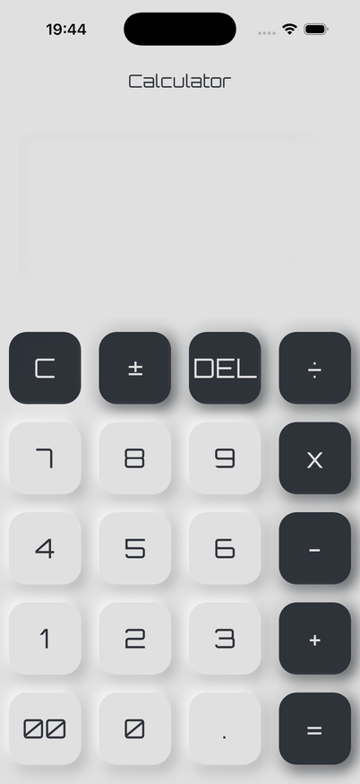
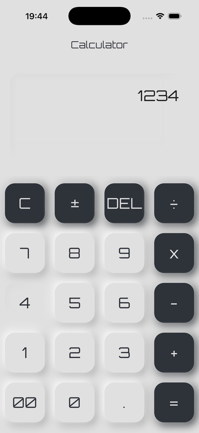
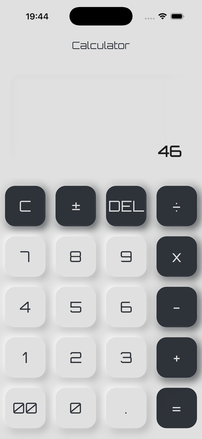
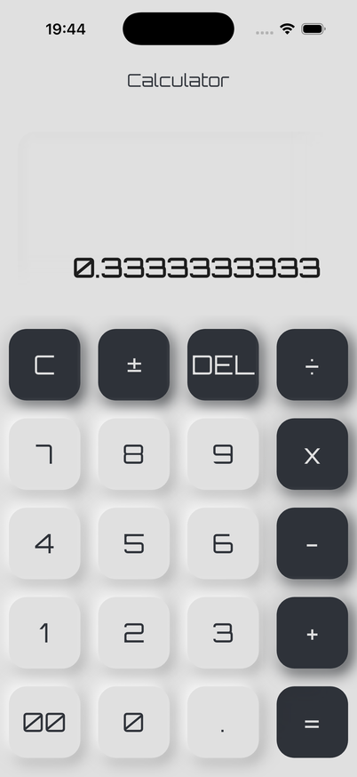
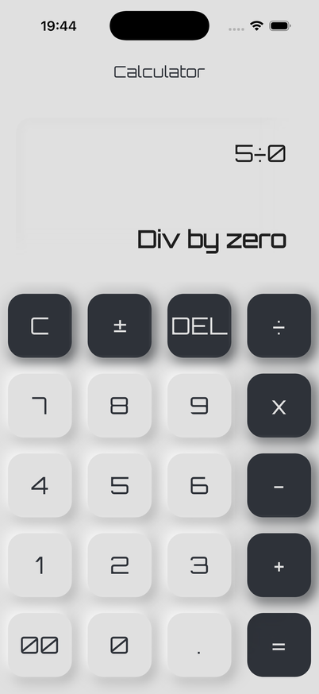

# Calculator

A four-function calculator with a neumorphic keypad.

## States

|                                        |                                         |                                            |
| :------------------------------------: | :-------------------------------------: | :----------------------------------------: |
|    |   |  |
|                  idle                  |            entering a number            |               an expression                |
|  |  |    |
|                a result                | a quotient that does not divide evenly  |             a negative result              |
|   |                                         |                                            |
|            division by zero            |                                         |                                            |

## Running it

```bash
flutter pub get
flutter run
```

The first run on the iOS simulator can fail with `Xcode build is missing
expected TARGET_BUILD_DIR build setting`. Run the same command again: the
Xcode build succeeds either way, and Flutter only reads the build settings in
time once they are cached.
