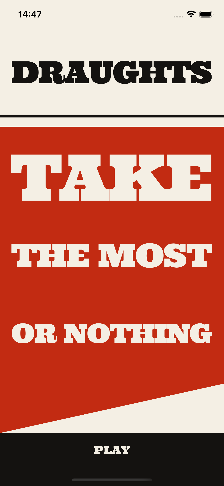
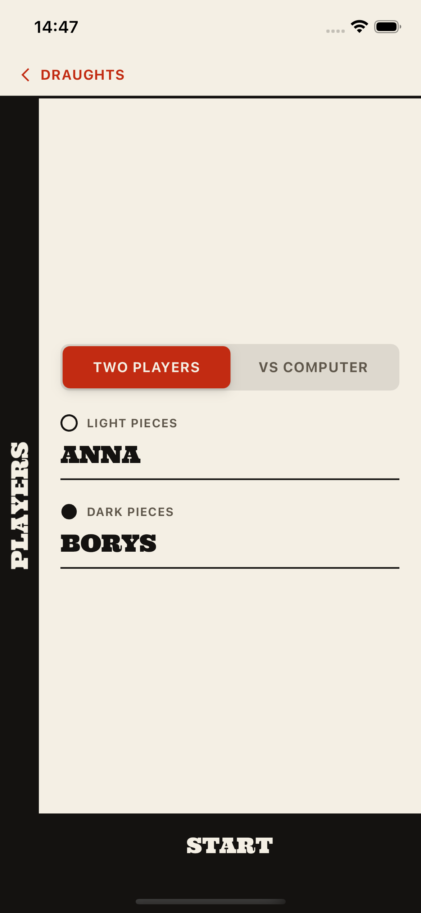
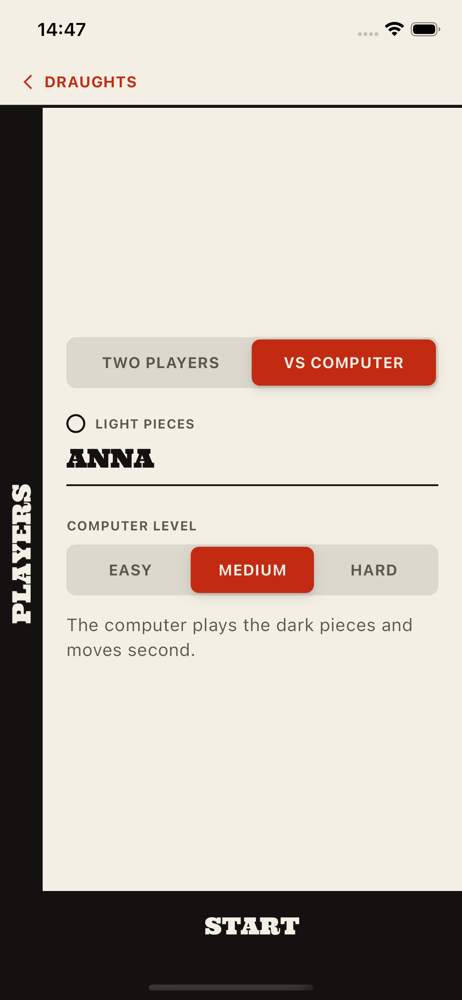
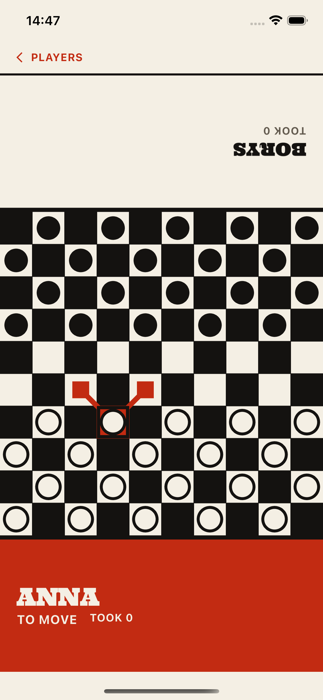
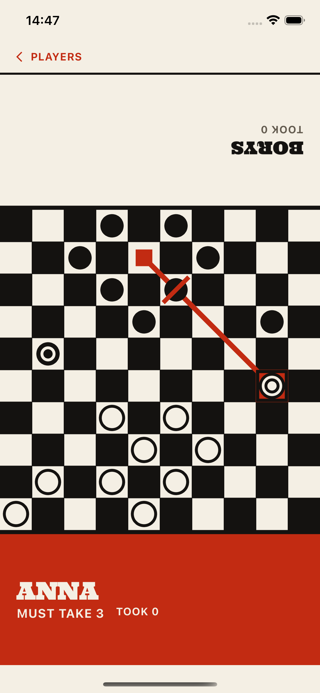
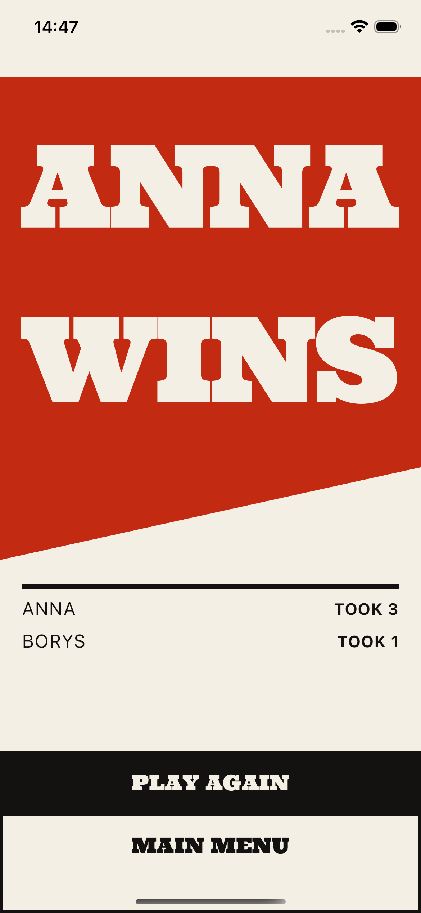

# Draughts

International draughts on a ten by ten board, set as a printed page: black on
paper, one vermilion, heavy slabs. Two players share the phone or one of them
plays the computer, and every capture sequence is worked out by the app before
you touch a piece.

## Screens

|                                              |                                                  |
| :------------------------------------------: | :----------------------------------------------- |
|      | the title page, stating the rule it enforces      |
|      | two players, each with a nickname                 |
|   | against the computer, at one of three levels      |
|   | a piece picked up, rules running its legal moves  |
|      | kings on the board, and a capture the rules force |
|     | the game decided, with the final tally            |

## Playing it

Capture is compulsory, and among all the capture sequences on the board you
must take one that captures the most pieces. The board says so itself. The
squares of the pieces the rules allow are printed in vermilion, and the slab
under the name of whoever is to move reads MUST TAKE and the number the rules
demand. Reach for a piece that cannot take that many and it is struck out
where it stands.

Pick a piece up and heavy vermilion rules run out along its playing diagonals
to every square it may land on, and across every piece the move would take. A
man moves forward but captures in every direction, a king travels any distance
along a diagonal, and captured pieces stay on the board, struck through, until
the whole chain is finished. A man that ends its move on the far row is
crowned; one that only passes through it mid chain stays a man. A king is a
disc with a ring struck out of it.

Both names are set in slabs, one at each end of the board and the far one
turned upside down, so the page reads from either side of a table. A square on
a ten by ten board is narrower than a fingertip, so a tap resolves to the
nearest square the rules allow rather than to the pixel it landed on.

The page prints ink on paper by day. In the dark it inverts to the press plate,
ground and marks trading places, because the game is mostly played in the
evening and a sheet of white paper is the wrong thing to hold up in a dim room.

Easy answers at random, medium picks whatever looks best after a single move,
and hard searches ahead under a time limit. Nicknames are kept between
launches.

## Running it

```bash
flutter pub get
flutter run
```
