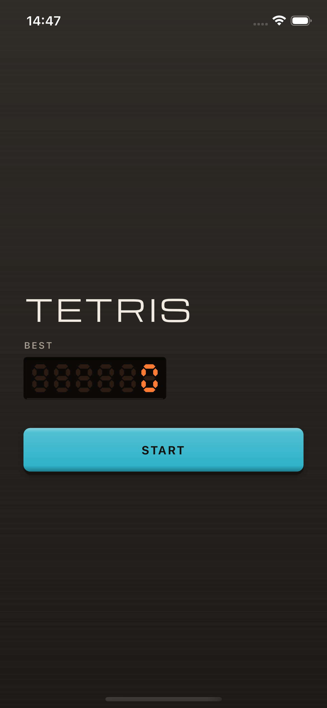
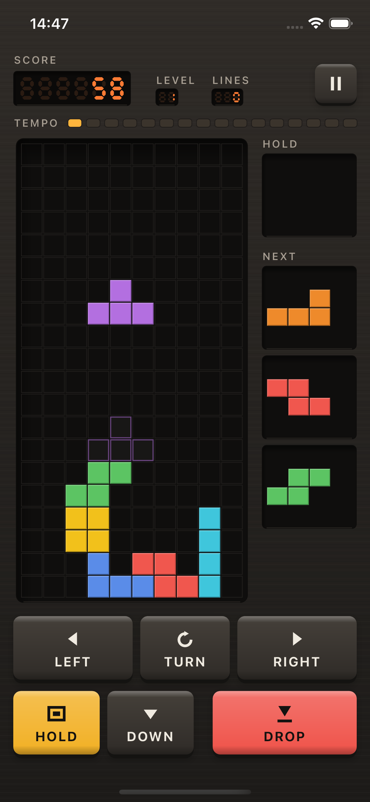
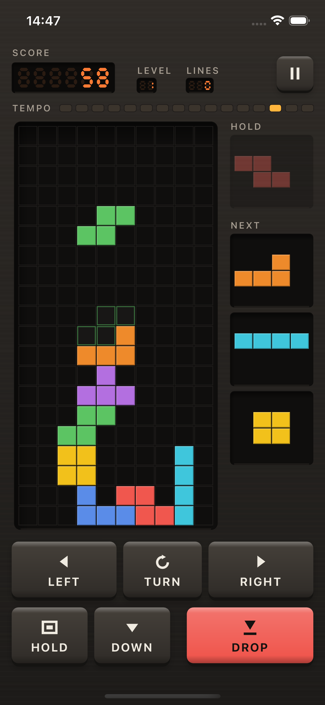
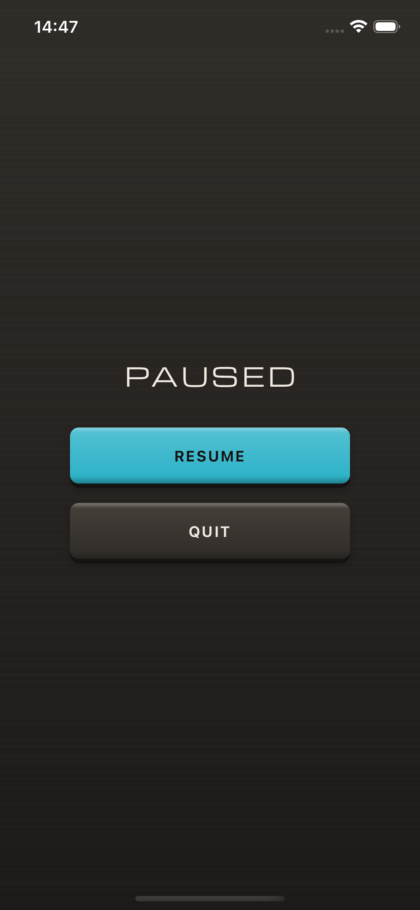
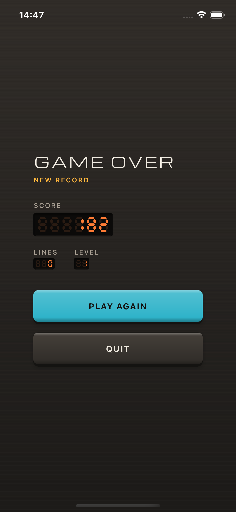

# Tetris

A tetris built as an early-eighties rhythm machine. The well is a step row
running under a clock, so the level arrives as a tempo you can watch instead of
a number you have to look up. The seven pieces fall on a ten by twenty field,
turn by the SRS rules and kick clear of walls and stacks, and the best score is
kept between launches.

## Screens

|                                            |                                               |
| :----------------------------------------: | :-------------------------------------------- |
|    | the faceplate at rest, best score behind glass |
|  | a piece on its way down, its landing outlined  |
|     | one piece parked in HOLD, three more queued    |
|    | paused, a blank plate over the well            |
|     | a run that ended on a new record               |

## Playing it

Pieces arrive in shuffled bags of seven, so the same one never shows up three
times in a row. LEFT, RIGHT and DOWN repeat while held; TURN spins the piece
clockwise and shoves it clear when a wall or a stack is in the way. DROP is the
one key that cannot be taken back, so it sits apart from the row, wider than
the rest and under its own colour. HOLD parks a piece for later, once per drop,
and goes dark until the piece lands. A line scores 100 and four at once score
800, both multiplied by the level, and every ten lines the level goes up and
the pieces fall faster, from 800 ms per step down to 100. The lamp above the
well steps in time with the fall, so a level change is visible before it is
read.

The chassis takes a light finish by day and a dark one at night, following the
phone. The well and the display glass stay dark in both, so the field reads the
same under either.

## Running it

```bash
flutter pub get
flutter run
```
