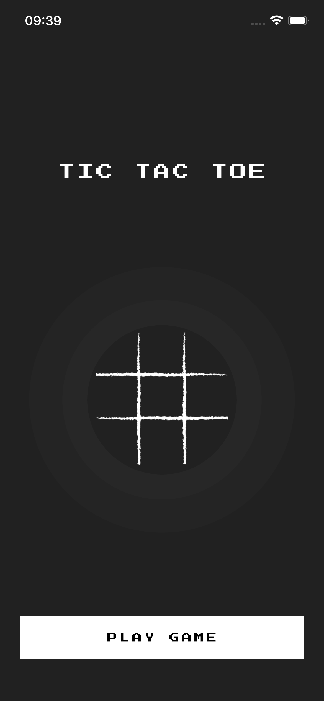
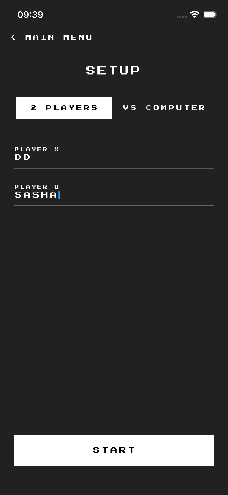
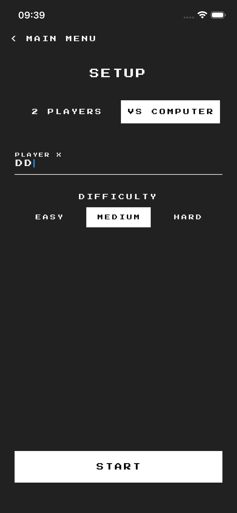
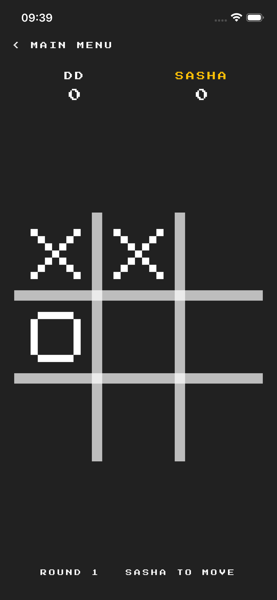
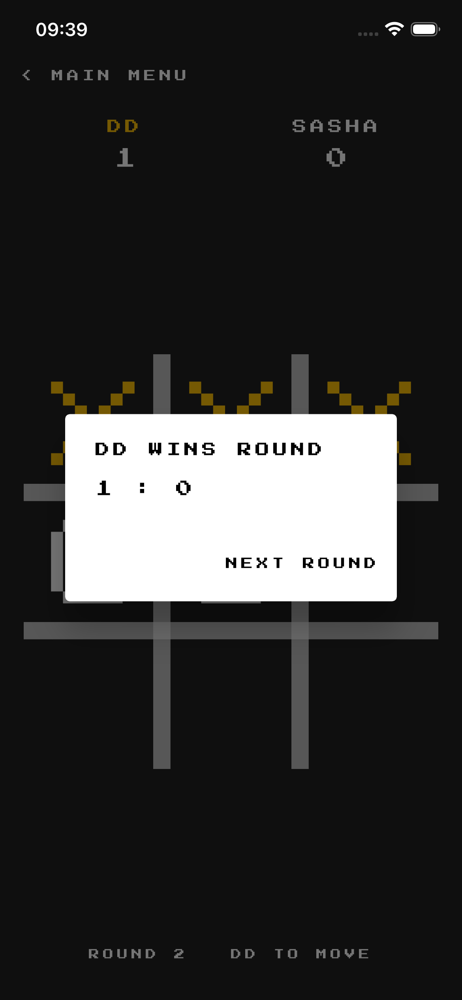
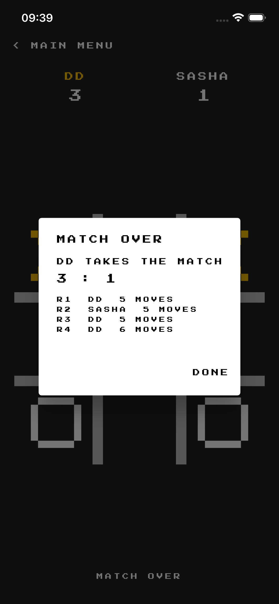

# Tic Tac Toe

A pixel-art tic-tac-toe. Two players share the phone or one of them plays the
computer, both sides pick a nickname, and a match runs until someone has won
three rounds.

## Screens

|                                             |                                              |
| :-----------------------------------------: | :------------------------------------------- |
|     | the title screen                             |
|     | two players, each with a nickname             |
|  | against the computer, at one of three levels  |
|      | a round under way, the side to move in gold   |
|     | a round won, the winning line lit up          |
|     | the match decided, with every round listed    |

## Playing it

Easy answers at random, medium takes a win or blocks one, hard searches the
whole game and deviates only now and then, which is the only way to beat it.
The loser of a round opens the next one. Nicknames are kept between launches.

## Running it

```bash
flutter pub get
flutter run
```
